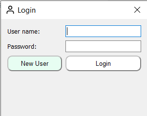
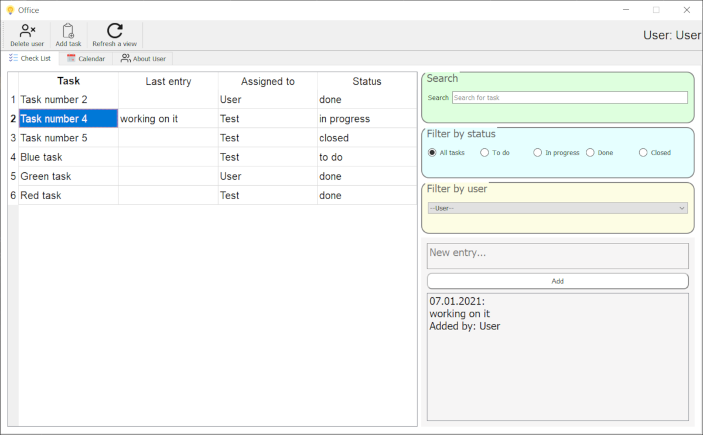
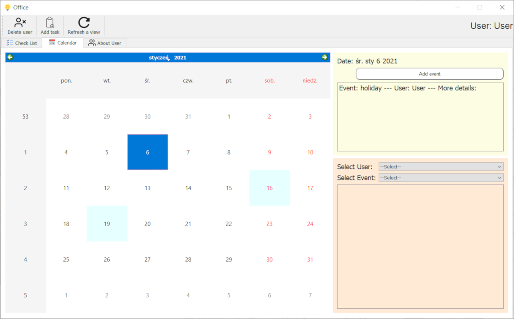

# Office Management - PyQt5 project
> This simple GUI app helps organize and manage small office.
## Table of contents
* [Motivation](#motivation)
* [Screenshots](#screenshots)
* [Technologies](#technologies)
* [Features](#features)

## Motivation
This project is created to keep learning GUI programming with PyQt5.

## Screenshots

## Technologies
* PyQt5 - version 5.15.2

## Features
* Add new tasks, assign them to team members and track their progress.
* Manage tasks assigned to you to make your workday more productive.  
* Add events to calendar.